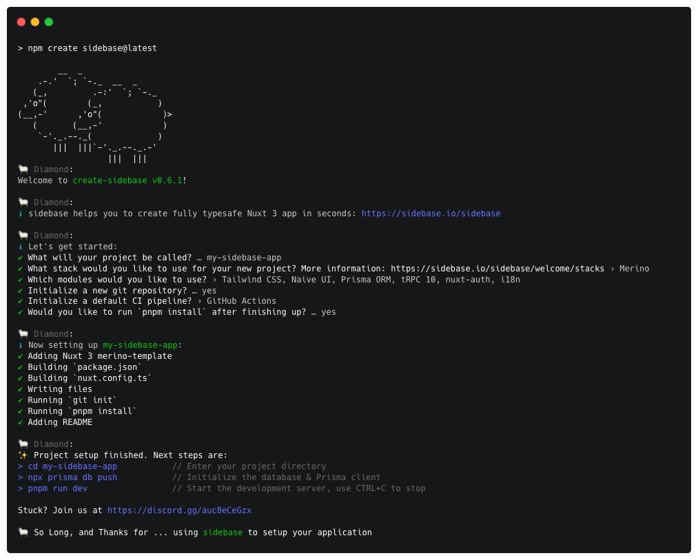

<h1 align="center">
    create-sidebase
</h1>

    Interactive CLI to kickstart a fullstack Nuxt 3 app.

  Get started with the <a target="_blank" href="https://sidebase.io/sidebase">sidebase</a> fully typed Nuxt 3 starter by running <code>npm create sidebase@latest</code>

    

## create-sidebase

[![npm version][npm-version-src]][npm-version-href]
[![npm downloads][npm-downloads-src]][npm-downloads-href]

[![License][license-src]][license-href]

> The productive way to build fullstack Nuxt 3 applications.

sidebase is a web app development kit to build production ready fullstack apps quickly. We build sidebase to provide a modular, modern, fully-typed and best-practice approach to make your ideas a reality. Around a core of TypeScript and Nuxt 3 sidebase adds components like databases, CI, authentication, testing and more.

<!-- Badges -->
[npm-version-src]: https://img.shields.io/npm/v/create-sidebase/latest.svg
[npm-version-href]: https://npmjs.com/package/create-sidebase

[npm-downloads-src]: https://img.shields.io/npm/dt/create-sidebase.svg
[npm-downloads-href]: https://npmjs.com/package/create-sidebase

[license-src]: https://img.shields.io/npm/l/create-sidebase.svg
[license-href]: https://npmjs.com/package/create-sidebase

## Features

- Automatic installation and setup of popular Nuxt3 modules
  - [TailwindCSS](https://tailwindcss.com/): A utility-first CSS framework packed with classes that can be composed to build any design, directly in your markup.
  - [Naive UI](https://www.naiveui.com/): A Vue 3 Component Library. Complete, Customizable, Uses TypeScript, Fast.
  - [Prisma ORM](https://www.prisma.io/): Next-generation Node.js and TypeScript ORM.
  - [tRPC 10](https://trpc.io/): Build end-to-end typesafe APIs in Nuxt applications.
  - [sidebase-auth](https://sidebase.io/nuxt-auth): Authentication via OAuth, Credentials and magic email flows. Wraps the popular NextAuth.js with 12k stars.
  - [i18n](https://i18n.nuxtjs.org/): I18n (Internationalization) module for your Nuxt project powered by Vue I18n.
- Premade CI pipeline templates, built for Nuxt
  - [Github Actions](https://docs.github.com/en/actions)
  - [DroneCI](https://www.drone.io/)
